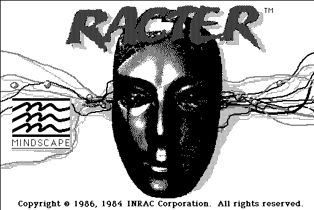

# INRAC LANGUAGE SPEC
*Draft version*

Greg Kennedy, 2020

## OVERVIEW
The INRAC interpreter is a virtual machine that operates on code written in a special template language.  The VM has a short memory bank, the ability to load or unload further code to fit into RAM, and functions for reading user input, printing text to output, performing text matching and parsing, and flow control via labeled jumps or subroutines.

The original INRAC machine ("Racter") was developed by William Chamberlain and Thomas Etter in 1983, to help write the book "The Policeman's Beard is Half-Constructed".  This version (hereafter, "Version 0") was not released to the public.  It was reportedly written in BASIC, targeting a Z80-based machine running CP/M with 64kb of RAM.

In 1984 Mindscape, Inc. released a version of the Racter program for MS-DOS computers (Version 1).  This version was written in (or ported to) Microsoft BASIC-86 and compiled using Microsoft BASIC Compiler 5.35.

Mindscape also ported Racter to Apple II, Amiga, and Macintosh computers (Version 2).  These ports use a slightly different data file format than the MS-DOS version.

In addition, the Racter developers attempted to license the underlying INRAC language to others interested in electronic literature or AI development.  There was at least one user, Hale Chatfield (of Hiram College, Ohio) who released some works under the name "Chatfield Software".  The re-licensed version also appears to use Version 2 files.

## THE INRAC VIRTUAL MACHINE
This section describes some features of the INRAC interpreter, and known limitations.

### CODE STORAGE
INRAC code is stored in "sections" up to 255 lines in length.  There are 99 section slots available, which can be loaded and unloaded at will.  Each code file specifies the intended slot, numbered 1 to 99, which it will load into.  Loading code to an already used section will unload the section first.  In this way, memory usage can be controlled, by keeping only sections in RAM that are needed for processing.

In the BASIC interpreter, this is stored as a 99 by 256 array of strings.

Code sections have different "type" values, stored in the header.  The "type" may or may not affect the interpreter rules.  The most common type is 5, which seems to indicate a "code" (normal) parsing.  Others such as 2 or 8 may indicate some sort of vocabulary handling.

### INTERNAL MEMORY
The INRAC "machine" has a limited internal memory: a 100-cell array of strings.  This array index is 1-based.  For the most part, the variable store is generic - the programmer may assign locations freely.  However, there are certain built-in functions which rely on specific reserved slots.  For instance, user input is always copied into variable 1.

There are built-in functions for loading, saving, and clearing the variable array.

Typically, an INRAC program will use some convention for persisted info (for example, the Racter data file always uses location 40 for user's first name, 53 for their last).

In addition to the strings array, there is a pointer called "F" which points to a word in a sentence.  This pointer can be moved around and compared to other words - it is how INRAC programs do matching of text.  User entry is counted from `F=1`, but the pointer can actually be placed anywhere from `F=0` ("before" the first word) or `F=E+1` ("after" the last word).

Finally, there is a Condition flag which can be set / cleared using some Test functions.  It can be also be checked and thus used to do branching.

### PROCESSING
Code lines begin with a label, then contain a series of character opcodes with embedded text.  It helps to think of the lines as "smart templates," where text output is the "default" case, and opcodes trigger special interpolation or other behavior.

Each line of a code section begins with some letter opcodes.

* `$xx` - Recall a variable from internal memory.  Memory is an array of 100 strings, which can be stored to or read from.
* `??` - Get user input.  This triggers the interpreter to read a line of text from the user, and store it into internal memory (variable #1)
* `%aaa` - Load an additional script file aaa.rac.  The initial Racter file is small, but additional sections can be loaded from disk as needed.
* `:` - Call interpreter function.  These hooks invoke special functions provided by the interpreter, typically for file access or similar.
  * `:ZAP` - Clear internal variable memory, cells 10 onwards.  In other words, preserve cells 1 through 9 inclusive.
  * `:ZEROC` - Clear ALL internal variable memory.
  * `:LOADaaa` - Load variable memory from file named "aaa.iv".
  * `:PUTaaa` - Save variable memory to file named "aaa.iv"
  * `:OUTaaa` - Open "aaa.out" and record a copy of all I/O to it.  If no filename is given, default to INRAC.OUT.
  * `:F` - Manipulate the F word-pointer.  Note that although `n` is used in these examples, the MS-DOS interpreter does not support most numbers.
    * `:F=n` - Set F to point at the nth word, e.g. F=1 points to the beginning of the string, F=2 to the second word, etc
    * `:F=E` - As a special case of F=n above, F=E will move the pointer to the last word in the sentence.
    * `:F=E+1` - Point F at one cell past the last word.
    * `:F+n` - Advance F by n words, advancing past the end sets the pointer to the last word
    * `:F-n` - Backtrack F by n words, going beyond the first word will simply set F=0.
  * `:TALK` - Enables TTS (for systems that support it)
  * `:DEC-TALK` - Enables TTS, and additionally writes the string `[:NV]` to the TTS device - presumably this is a control sequence for the DEC-Talk DTC-01.
  * `:TALK-OFF` - Disables TTS
  * `:SCREEN-ON` - Enables local print/echo to the screen
  * `:SCREEN-OFF` - Disables local print/echo to the screen
  * `:;;` - Debug function: print variable cell 1 (user's input), as parsed, as well as the state of F and the condition flag.
* `>n` - Functions to set the internal variable array.  Sets a value for slot n in the array based on the following...
  * `>n*aaa` - Copies the line from aaa to this variable
  * `>$$n` - Inverse lookup: set n to label that n was set from.  The associated label is "sticky" and can be copied from one variable to another, even persisting past literal assignment, but lost on `PUT` or `LOAD`.
  * `=` - Set nth item to a value
    * `=F` - Copy the word pointed to by F into this variable slot
    * `=xx` - Copy variable slot xx into n
    * `=L` - Copy all words before F into this variable
    * `=R` - Copy all words after F into this variable
    * `=C` - Uppercase the first letter of the string in n, and store back to itself
    * `=aaa` - Assign literal string "aaa" to n.  An empty string clears n.
* `?` - Functions to execute tests and set or clear the condition flag.
  * `-:` - Inverts the result of condition testing.
  * `?*n` - Tests if any word from input is found anywhere in code section `n`.  This also moves `F` to point at the word (or to E+1 if not found)
  * `?n=a` - Tests if variable n equals constant a
  * `?aaa` - Tests if any of the words in list "aaa" (comma-separated) match entries in Variable 1 (User input).
  * Special tests which operate on input word `F` - these accept a suffix modifier like `+` or `-` to temporarily move `F`.
    * `?Q` - Tests if word `F` ends in a question mark.
    * `?CAP` - Sets `F` to the first capitalized word in cell 1, and returns True if found.  `CAP+` will search beginning from `F`.  (MS-DOS version has some bugs with this)
    * `?PUNC` - Tests if word `F` has punctuation.
    * `?ROOT` - Currently unknown.
* `#` - Stops line processing at this point, and immediately advances to the start of the next line.
  * `#*n` - Stops line processing and advances to the specified label (instead of the next line)
* `/` - Only perform the next opcode if condition flag is TRUE
* `\` - Only perform the next opcode if condition flag is FALSE

If none of these opcodes are hit, the word is just a piece of embedded (literal) text, and is passed as-is to the output string builder.

### OUTPUT FORMATTING
INRAC contains a number of tokens for managing output presentation.

* `A` - If the next word begins with a vowel, output "An", else "A".  (This applies for lowercase "a" as well.)
* `C` - Causes the first character of the next word to be Capitalized
* `D` - Causes the first character of the next word to be DE-Capitalized
* `S` - Same as `C` (?)
* `aaa>` - Do not include a trailing space after this substring
* `<aaa` - Do not insert whitespace before this substring

Punctuation is usually separated by a double space.

The MS-DOS version implements this by delaying printout of a word until the next has been parsed.  This can lead to odd side effects.  For example, `:SCREEN-OFF` will skip printing the final word of a sentence.

## DATA FILE LAYOUT
There are at least two data file formats in use.  These are not interchangeable between interpreters.
* The first format is used for the MS-DOS version of Racter.  Data files in this format use a `.RAC` file extension.
* The second is for Apple II and Mac, but it also appears in third-party MS-DOS programs built on INRAC.  Data files in this format use a `.ZIP` file extension, although they are not actually PK-Zip compressed file archives.

### VERSION 1 (MS-DOS) DATA LAYOUT
The INRAC data fles are ASCII text and MS-DOS crlf terminated.  Each file consists of a Header, a number of Section Definitions, and then a series of code lines.

Data files begin with a header of the following, one per line:
* Source-file title, comment, or description - can be ignored by the interpreter
* Index of first section - sections are loaded sequentially into internal code memory, beginning from this value
* Count of sections in file
* Total count of lines across all sections

Section definitions follow:
* Section title, comment, or description
  * If the section header contains `ALPH`, it has (unknown) special meaning.
  * If the section header contains `UNIQ`, it has a different (unknown) special meaning.
* Number - unknown, assumed to be "section type"
* Number of lines in section

After section definitions, all lines of code follow.  Here is an example data file with two sections, 7 lines of code.  Section 1 begins at label A, section 2 at label B.  (An X is typically used for a dummy label)

    SAMPLE.IF Example file for INRAC documentation 09-02-2018
     1
     2
     7
    SECTION 1 hello
     5
     3
    SECTION 2 goodbye
     5
     4
    A Hello there!  This is a sample line. #
    X There is more text here. #
    X This is the last line of Hello. #
    B Goodbye now. #
    X There is more text here. #
    X There is even more text here. #
    X This is the last line of Goodbye.

### VERSION 2 (APPLE, AMIGA, MAC, 3RD PARTY) DATA LAYOUT
*To Do*
